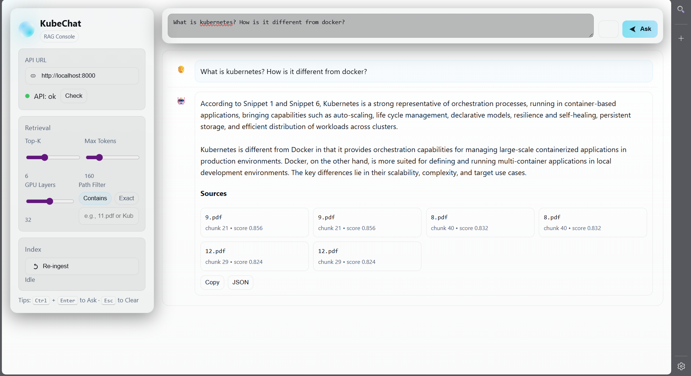
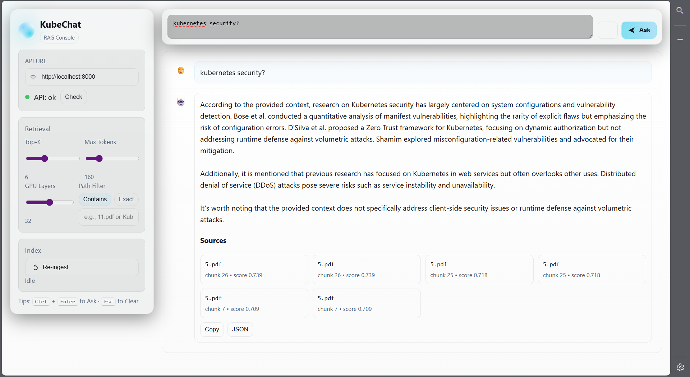

# KubeChat

KubeChat is a lightweight yet powerful question–answering system built on top of Docker and Kubernetes.  
It allows you to ingest PDF documents, index their contents, and interact with them through natural language queries.  
The application combines a clean web interface with containerized orchestration to ensure reproducibility, scalability, and modular deployment.

---

## Project Goals

- Provide a containerized environment to demonstrate the orchestration of AI-powered document search and Q&A.  
- Offer a practical educational tool to understand how Docker and Kubernetes can be used in real-world NLP applications.  
- Build a futuristic but simple user interface that enables anyone to query PDFs seamlessly.  
- Support re-ingestion of documents for dynamic knowledge updates.  

---

## 🔍 Perplexity vs. KubeChat

While KubeChat draws inspiration from AI search engines like **Perplexity**, its design goals and architecture are very different.  
Here’s a side-by-side comparison:

| Feature                | **Perplexity** | **KubeChat (this project)** |
|-------------------------|----------------|-----------------------------|
| **Models**             | Uses commercial + open LLM APIs (GPT-4, Claude, Mistral, Llama-2, etc.) | Runs models locally via **Ollama** inside Kubernetes (TinyLlama, Mistral, CodeLlama, or any you choose) |
| **Knowledge Access**   | Live web search + retrieval with citations | Retrieval from **your PDFs/docs** via Qdrant vector database |
| **Infrastructure**     | Fully managed SaaS (their cloud) | **Self-hosted** on Kubernetes (private, controllable, extensible) |
| **Business Model**     | Pro subscription ($20/mo), reseller of upstream APIs | Showcase / developer platform; no API costs if using open weights |
| **User Experience**    | Polished, consumer-grade search UI with collections and threads | Functional, developer-focused UI (showcases infra + RAG pipeline; customizable) |

### ⚖️ Summary
- **Perplexity**: A consumer-facing AI search engine, effectively reselling API access with a clean UX layer.  
- **KubeChat**: A self-hosted RAG showcase — Ollama + Qdrant + Kubernetes — giving full control over models, data, and infrastructure.

---

## Features

- **Containerized Deployment**  
    - Powered by Docker for reproducibility.  
    - Kubernetes support for scaling ingestion and querying services.  

- **Document Ingestion**  
    - Scans and indexes all PDFs in `/app/docs`.  
    - Re-ingestion option to rebuild the index when new documents are added.  

- **Interactive Q&A Interface**  
    - Ask natural language questions directly about the uploaded PDFs.  
    - Filter queries using `path_contains` or `path_exact` for targeted retrieval.  
    - Configure runtime parameters such as `top_k`, `num_predict`, and `num_gpu`.  

- **Source Transparency**  
    - Displays source chunks, file paths, and confidence scores for every answer.  

- **Modern Web UI**  
    - Built with a futuristic design (see screenshots below).  
    - Responsive layout for desktop and mobile.  

---

## Screenshots

### Main Interface


### Answer & Sources Display


---

## How It Works

1. **Start the API**  
     The backend runs as a containerized service exposing `/health`, `/ingest`, and `/chat` endpoints.  

2. **Check Health**  
     UI checks API health on startup (`/health`).  

3. **Ingest Documents**  
     Trigger document scanning and indexing using `/ingest`.  

4. **Ask a Question**  
     Submit queries via `/chat`. The API returns the answer along with relevant sources.  

---

## Tech Stack

- **Frontend**: HTML, CSS (custom futuristic theme), Vanilla JS.  
- **Backend**: Python (FastAPI), PDF parsing, vector search.  
- **Containerization**: Docker, Kubernetes.  
- **Deployment**: Minikube / local clusters, cloud-ready.  

---

## Running the Project

1. **Build and Run with Docker**  
     ```bash
     docker build -t kubechat .
     docker run -p 18080:18080 kubechat
     ```

2. **Kubernetes Deployment (example with Minikube)**
     ```bash
     kubectl apply -f kubechat-deployment.yml
     kubectl get pods
     ```

3. **Open the UI**  
     Navigate to 👉 [http://localhost:18080](http://localhost:18080) to access the KubeChat interface.

---

## API Examples

**Health Check**
```powershell
Invoke-RestMethod http://localhost:18080/health

## Re-ingest Documents
Invoke-RestMethod -Method Post http://localhost:18080/ingest

## Simple Q&A
$body = @{
  question    = "What is Kubernetes used for?"
  top_k       = 6
  num_predict = 160
  num_gpu     = 32
} | ConvertTo-Json -Compress

Invoke-RestMethod -Uri http://localhost:18080/chat -Method Post -ContentType 'application/json' -Body $body

## File Specify Q&A
$body = @{
  question    = "Summarize this paper in 3 bullets."
  top_k       = 6
  num_predict = 160
  num_gpu     = 32
  path_exact  = "11.pdf"
} | ConvertTo-Json -Compress

Invoke-RestMethod -Uri http://localhost:18080/chat -Method Post -ContentType 'application/json' -Body $body

## License

This project is for demonstration and showcase purposes only.
No permission is granted to copy, distribute, or modify the codebase, in whole or in part.

All rights reserved © 2025 Aditya Saxena.